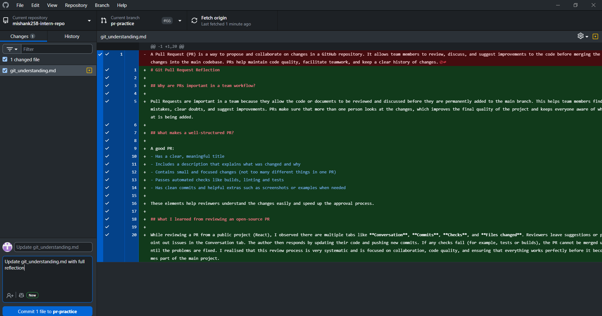

# Git Pull Request Reflection

## Why are PRs important in a team workflow?

Pull Requests are important in a team because they allow the code or documents to be reviewed and discussed before they are permanently added to the main branch. This helps team members find mistakes, clear doubts, and suggest improvements. PRs make sure that more than one person looks at the changes, which improves the final quality of the project and keeps everyone aware of what is being added.

## What makes a well-structured PR?

A good PR:
- Has a clear, meaningful title
- Includes a description that explains what was changed and why
- Contains small and focused changes (not too many different things in one PR)
- Passes automated checks like builds, linting and tests
- Has clean commits and helpful extras such as screenshots or examples when needed

These elements help reviewers understand the changes easily and speed up the approval process.

## What I learned from reviewing an open-source PR

While reviewing a PR from a public project (React), I observed there are multiple tabs like **Conversation**, **Commits**, **Checks**, and **Files changed**. Reviewers leave suggestions or point out issues in the Conversation tab. The author then responds by updating their code and pushing new commits. If any checks fail (for example, tests or builds), the PR cannot be merged until the problems are fixed. I realised that this review process is very systematic and is focused on collaboration, code quality, and ensuring that everything works perfectly before it becomes part of the main project.

**What makes a good commit message?**  
A good commit message is short, clear, and tells exactly what was changed and why. It usually starts with an action word like *Add*, *Fix*, *Update*, or *Remove*, and gives enough information so others can quickly understand the change.

**How does a clear commit message help in team collaboration?**  
Clear commit messages make it easier for team members to read the history of the project and understand what has happened without opening every file. This helps during reviews, debugging, and discussions because everyone knows what each commit is for.

**How can poor commit messages cause issues later?**  
Bad or vague commit messages like “updated” or “fixed stuff” don’t give any real information. This makes it hard in the future to understand what was changed, why it was changed, or when a bug was added. That can waste a lot of time when other people (or even I myself later) try to track down problems or understand the code history.

### 📌 Branching & Team Collaboration

### My Branch and PR Practice
 created a branch called `pr-practice` where I made these changes. I am currently waiting to get approval to merge this branch into the main branch. Once the changes are merged and approved, I will delete the `pr-practice` branch to keep the repository clean.

### Why is pushing directly to the main branch problematic?
Pushing directly to the main branch can cause problems because it may introduce bugs or errors straight into the main code. This can affect everyone who is working on the project and cause issues for the whole team.

### How do branches help with reviewing code?
Branches allow us to work on bugs or new features separately without affecting the main code. They let team members review the changes through commit messages and pull requests before merging. This way, the main code stays safe and stable.

### What happens if two people edit the same file on different branches?
If two people edit the same file on different branches, their changes stay separate until the branches are merged. When merging, Git will check for conflicts and ask the developers to fix any overlapping changes so everything works together properly.

### 📌 Debugging with git bisect

## What does git bisect do?
Git bisect helps find the exact commit where a bug was introduced by using binary search. It asks you to mark commits as good or bad and narrows down the problem quickly.

## When would you use it in a real-world debugging situation?
You use git bisect when you know a bug exists but don't know which commit caused it. It helps find the buggy commit fast, especially when there are many commits.

## How does it compare to manually reviewing commits?
Manually checking each commit one by one takes a lot of time. Git bisect cuts the number of checks needed by half each time, so it is much faster and easier.

## Testing I Did
I created a simple Python script for addition and subtraction.  
I made several commits, then introduced bugs deliberately in these functions.  
Using git bisect, I marked commits as good or bad, tested the script output, and found the exact commit where the bug was added.  
This showed me how git bisect helps quickly find bugs in code history.

